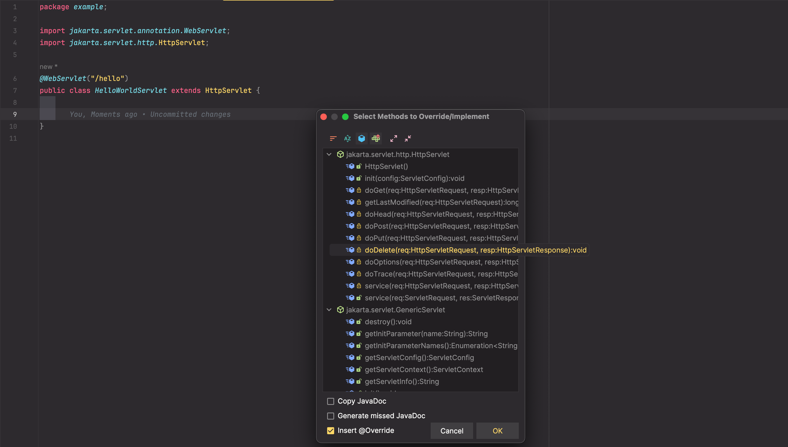

# 5장. 웹 서버 리팩토링, 서블릿 컨테이너와 서블릿의 관계

## 서블릿과 서블릿 컨테이너

- 서블릿 : 웹 서버의 `Controller`, `HttpRequest`, `HttpResponse`를 추상화하여 인터페이스로 정의해 놓은 표준
- 서블릿 컨테이너 : 서블릿에 대한 구현체(실제 웹 서버)
  - Tomcat, Jetty, JBoss, Undertow 등이 있음.

## 서블릿 예제 코드

[Link](./src/main/java/example/HelloWorldServlet.java)

위와 같이 HttpServlet 추상클래스를 상속하여 원하는 메소드를 override 하여 구현한다.

## 서블릿 컨테이너의 동작 순서

1. 서블릿 컨테이너 시작
2. classpath 에 있는 servlet 인터페이스를 구현하는 서블릿 클래스 탐색
3. @WebServlet 을 통해 요청 URL과 서블릿 매핑
4. 서블릿 인스턴스 생성
5. `init()` 메소드를 호출하여 초기화

## 서블릿을 사용하면?

Chapter 3. 에서 구현한 웹서버의 경우, 일일히 웹 연결에 대한 구현을 하느라 중요한 비즈니스로직 구현에 집중하지 못하였으나, 이부분을 서블릿이 대체해 줌으로써 개발자가 비즈니스 로직에 집중하게끔 해줌.

